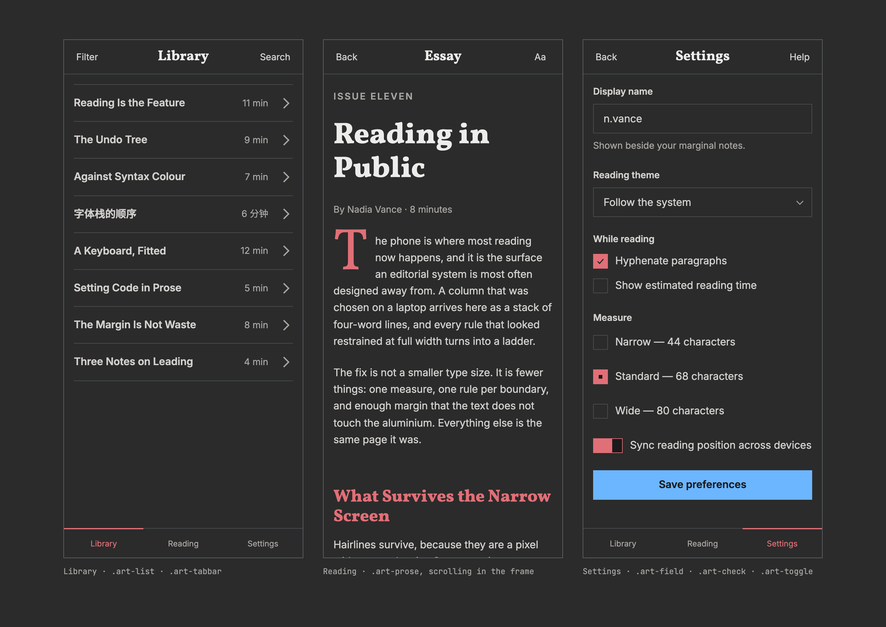
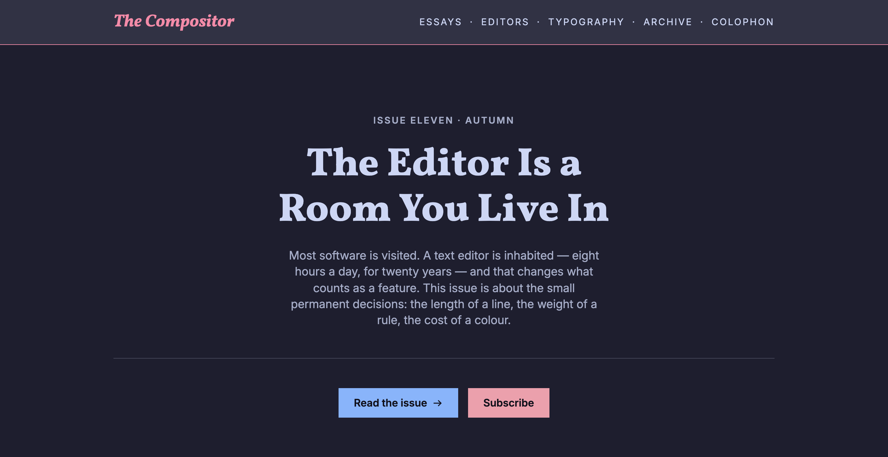

<h1 align="center">Article</h1>

<p align="center"><strong>Eliminate slop design.</strong></p>

<p align="center">A design language for software that is mostly words.</p>

<p align="center">
  <a href="https://gr13nka.github.io/article/demo/">Interactive demo &rarr;</a>
  &middot;
  <a href="FORK.md">Fork it</a>
  &middot;
  <a href="STYLE.md">The rules</a>
</p>

<p align="center">
  <picture>
    <source media="(prefers-color-scheme: dark)" srcset="docs/screenshots/web-dark.png">
    
  </picture>
</p>

Agents build competent interfaces that all look the same, because nothing tells them what
*your* software looks like. Article is that missing instruction, written down — a formal,
editorial kit for docs, dev tools, dashboards and reading apps. It looks like a well-set
page, not an app.

Fork it once, and everything you build afterwards looks like yours. It is a starting point,
not a finished brand: it ships one opinion and expects you to replace it.

## The loop

1. **Fork it.**
2. **Look at [the preview](https://gr13nka.github.io/article/demo/)** — every component, in
   every state, in both themes, on desktop and on a phone.
3. **Like it?** Point your agent at [`FORK.md`](FORK.md) and [`CLAUDE.md`](CLAUDE.md), and
   ask it to apply Article to what you're building.
4. **Don't?** Ask your agent to re-skin it first — an accent, a typeface, or a whole palette
   read out of a screenshot you like. Then reload the preview and *look before you apply*.
5. **Keep the fork.** Re-apply it to the next thing you build, and the thing after that.

`FORK.md` is written to be handed to an agent on its own. It carries the six values that
decide how the kit feels, the four traps that will bite, and the one command that says
whether the result is still legible. Reading the canon is not a prerequisite.

## What you get

- **No build step, no dependencies, no framework.** Two stylesheets and a `<link>`.
- **Light and dark, both first class** — plus a second dark palette in the box.
- **Every colour pair clears WCAG AA in both themes**, and a script proves it on every push.
- **Squared corners, hairlines, no shadows.** A radio button here is a square.
- **Desktop and mobile**, in English and Chinese.
- **~12 kB gzipped.**

## Use it

```html
<meta name="color-scheme" content="light dark">
<link rel="stylesheet" href="web/tokens.css">
<link rel="stylesheet" href="web/article.css">
<link rel="stylesheet" href="web/prose.css">   <!-- only for long-form text -->
```

```js
import { initTheme } from './web/theme.js';
const theme = initTheme();          // light / dark / follow the system
themeButton.addEventListener('click', theme.cycle);
```

That is the whole setup. Fonts and the no-flash snippet are in [index.html](index.html) —
copy the `<head>` from there.

`prose.css` styles plain HTML inside `.art-prose`, so rendered Markdown just works, with no
classes at all.

## Both themes

Neither theme is the other one dimmed. Each value is chosen for the job it does in that
theme — which is why the masthead is a crimson block in light and a raised panel with an
accent edge in dark.

| Light | Dark |
| :---: | :---: |
|  |  |

A second dark palette ships alongside the default. Switching is one attribute —
`<html data-dark="catppuccin">`:

<p align="center">
  
</p>

## Make it yours

Six values decide how the kit feels. **[FORK.md](FORK.md)** is the recipe.

Seen a design you like? Screenshot it and read the colours straight out of the image:

```sh
node tools/palette-from-image.mjs ref.png --roles
```

You get the colours, mapped to Article's roles, with the contrast already checked. Article's
own light theme was built this way. Then:

```sh
node tools/check-sync.mjs --contrast
```

Green means you're done. That is the only test you have to pass.

## Run it locally

```sh
git clone https://github.com/gr13nka/article && cd article
python3 -m http.server 8770
```

Open <http://127.0.0.1:8770/>. Use `http`, not `file://` — ES modules do not load over
`file://`.

## Type

**Vollkorn** for headings, **Inter** for text, **JetBrains Mono** for code. Chinese falls
back to **Noto Serif SC**, **Noto Sans SC** and **Noto Sans Mono**.

If you change a font, keep the Latin face first in the stack. The Noto fonts include Latin
too, and will quietly take over the whole page if you put them first.

## Two rules worth knowing

**Colours are defined once**, using CSS `light-dark()`. There is no second copy of the
palette to fall out of sync.

**Never put a colour inside a `data:` URI.** `currentColor` cannot reach in there, so the
mark can never follow the theme. Marks live in `ornaments/` and are drawn with `mask-image`.
Get this wrong and the design can never have a dark mode.

## What's where

| Path | |
|---|---|
| `web/tokens.css` | All the colours, type and spacing. **The file you edit** |
| `web/article.css` | Components — buttons, forms, tables, lists, app bars |
| `web/prose.css` | Long-form text |
| `web/theme.js` | Theme switching |
| `ornaments/` | The little marks — fleuron, checks, chevrons |
| `index.html` | The landing page |
| `demo/index.html` | The preview — every component in every state |
| `demo/type.html` | Typeface sampler, for choosing by eye |
| `FORK.md` | How to re-skin it. **Hand this to your agent** |
| `CLAUDE.md` | The rules an agent breaks by accident |
| `THEMING.md` | More detail on palettes and type |
| `STYLE.md` | The rules, and why they exist |
| `DECISIONS.md` | What was decided, and what was rejected |
| `tools/check-sync.mjs` | Drift checker and contrast gate |
| `tools/palette-from-image.mjs` | Read a palette out of a picture |
| `tools/shoot.mjs` | Regenerate these screenshots |

## Licence

MIT. Use it, fork it, make it yours.
