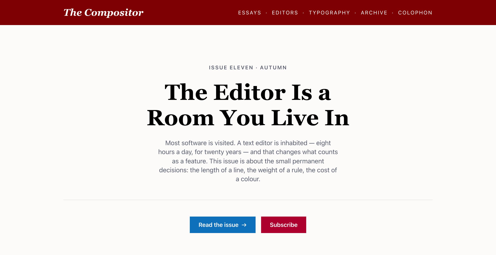
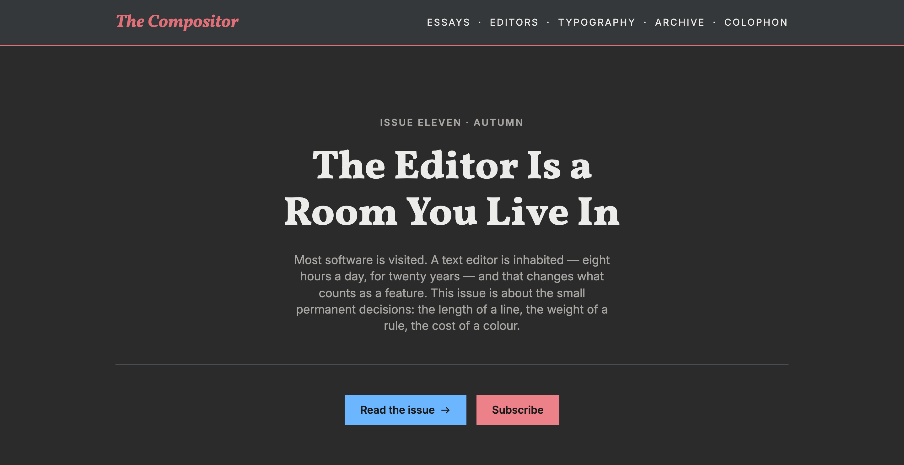
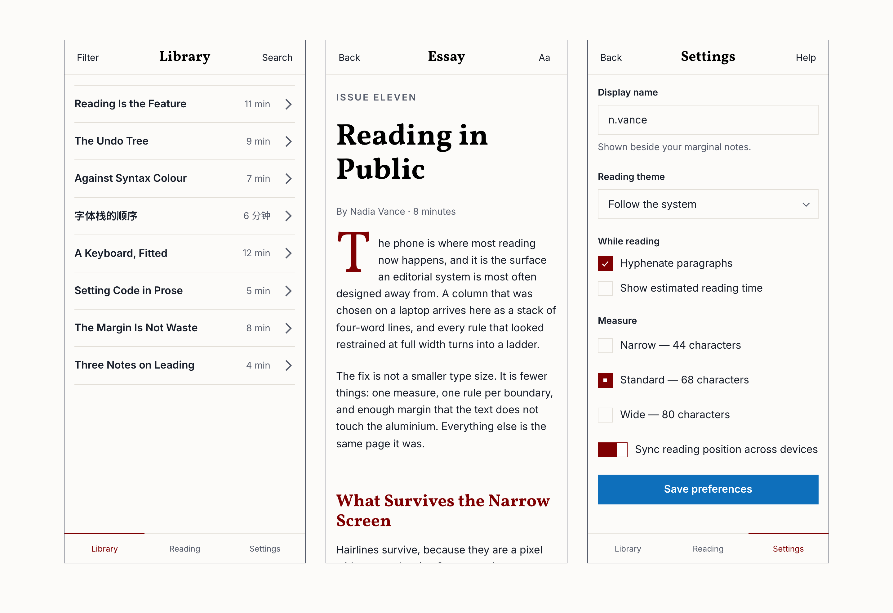

# Article

**A formal editorial design system for software that is mostly words** — reading tools,
developer tools, documentation, dashboards, admin surfaces. It reads like a well-set page
rather than like an app: the authority comes from typography and whitespace, not from chrome.

<p align="center">
  
  
</p>

- **No build step, no dependencies, no framework.** Plain CSS and one small ES module.
- **Two-layer tokens.** Re-colour the entire system by editing primitives in one file;
  components never see a raw colour.
- **Light and two dark palettes** — Darcula by default, Catppuccin as an alternate.
- **WCAG AA is enforced, not claimed.** A checker measures every text-on-surface pair in
  every palette and fails the build below 4.5:1.
- **Squared off.** Hairlines, no shadows, no gradients, no rounded corners.
- Sets **English and Simplified Chinese** out of the box.

## Run it

```sh
git clone https://github.com/gr13nka/article && cd article
python3 -m http.server 8770
```

Open <http://127.0.0.1:8770/demo/index.html> — the whole system on one page: an editorial
site, three phone screens, and a component gallery, with theme and palette switches. Serve
over http; ES modules do not load from `file://`.

## Use it

```html
<head>
  <!-- Set the theme before first paint, or the page flashes. -->
  <script>
    (function(){try{var m=localStorage.getItem('art-theme');
    if(m==='light'||m==='dark')document.documentElement.setAttribute('data-theme',m);}catch(e){}})();
  </script>

  <link rel="preconnect" href="https://fonts.googleapis.com">
  <link rel="preconnect" href="https://fonts.gstatic.com" crossorigin>
  <link href="https://fonts.googleapis.com/css2?family=Vollkorn:ital,wght@0,400..900;1,400&family=Inter:wght@400;500;600;700&family=JetBrains+Mono:wght@400&display=swap" rel="stylesheet">
  <!-- Chinese. Served in ~300 unicode-range slices, so a page with no Chinese
       on it downloads none of these files. Drop the line if you never need CJK. -->
  <link href="https://fonts.googleapis.com/css2?family=Noto+Serif+SC:wght@400;700;900&family=Noto+Sans+SC:wght@400;500;700&family=Noto+Sans+Mono:wght@400&display=swap" rel="stylesheet">

  <link rel="stylesheet" href="web/tokens.css">
  <link rel="stylesheet" href="web/article.css">
  <link rel="stylesheet" href="web/prose.css">   <!-- only if you render long-form text -->
</head>
```

```js
import { initTheme } from './web/theme.js';
const theme = initTheme();                 // light / dark / follow-the-system
document.querySelector('#theme-toggle').addEventListener('click', theme.cycle);
```

That is the whole integration. Theming is `color-scheme` plus CSS `light-dark()`, so no
component ever branches on which theme is active.

`web/prose.css` styles **bare HTML** under `.art-prose` — `h1`–`h4`, `p`, `blockquote`,
`code`, `table`, `hr` — so rendered Markdown needs no class attributes at all.

## Fork it

Article is a starting point, not a finished brand. **[FORK.md](FORK.md)** is the whole
recipe — six values, one command, and the four traps that cost us real debugging time.

Point it at a design you like and read the colours straight out of the screenshot:

```sh
node tools/palette-from-image.mjs ref.png --roles
```

It returns the dominant colours mapped onto Article's roles with **the contrast of each
suggestion already measured** — so an unusable colour is rejected before you adopt it. That
is how Article's own light palette was derived.

```sh
node tools/check-sync.mjs --contrast    # the stop condition: green means done
```

<p align="center">
  
</p>

## What's in here

| Path | What it is |
|---|---|
| `web/tokens.css` | All `--art-*` tokens. **The one file a fork edits** |
| `web/article.css` | Component classes (`.art-btn`, `.art-bar`, `.art-table`, …) |
| `web/prose.css` | Long-form layer — styles bare HTML under `.art-prose` |
| `web/theme.js` | Theme control: light / dark / follow-the-system |
| `ornaments/` | The marks — fleuron, dinkus, check, chevrons. Geometric, mirror-symmetric |
| `demo/index.html` | The showcase |
| `demo/type.html` | Typography sampler — compare candidate faces side by side |
| `FORK.md` | How to re-skin it |
| `THEMING.md` | The longer version: palettes, type, what not to change |
| `STYLE.md` | The constitution — read it for *why*, not for *how* |
| `DECISIONS.md` | Append-only log: every decision, and what was rejected |
| `tools/check-sync.mjs` | Drift checker and contrast gate. Report-only, exits non-zero |
| `tools/palette-from-image.mjs` | Read a palette out of a reference screenshot |

## Type

**Vollkorn** (display serif), **Inter** (body sans), **JetBrains Mono** (code), with Chinese
falling through to **Noto Serif SC**, **Noto Sans SC** and **Noto Sans Mono**.

Each token is a stack with the Latin face **first** — both Noto SC families carry complete
Latin glyph sets and would otherwise silently take over the whole page.

## Two rules worth knowing

Both exist because of specific failures, and both are enforced by the checker.

**Every semantic colour is declared exactly once, via `light-dark()`.** The alternative — a
`prefers-color-scheme` block plus a `[data-theme]` block — needs the dark palette written
twice, in two places that drift.

**No colour is ever baked into a `data:` URI.** `currentColor` cannot reach inside one, so a
mark defined that way can never follow the theme or the accent. This single defect is what
kept a sibling project from ever shipping a dark mode.

## Licence

MIT — see [LICENSE](LICENSE). Use it, fork it, rebuild it in your own colours.
