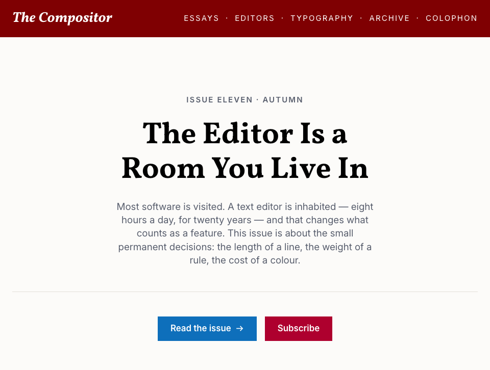

<!-- craft-readme: voice=plain -->
<div align="center">

<h1>Article</h1>

<p><strong>Eliminate slop design.</strong></p>

<p>A CSS design language for software that is mostly words: docs, dev tools, dashboards, reading apps.</p>

<p><a href="https://gr13nka.github.io/article/demo/">Preview</a> · <a href="https://gr13nka.github.io/article/demo/gallery.html">Components</a> · <a href="FORK.md">Fork it</a> · <a href="STYLE.md">The rules</a></p>

<picture>
  <source media="(prefers-color-scheme: dark)" srcset="docs/screenshots/web-dark.png">
  
</picture>

<br><br>



</div>

Agents build interfaces that all look the same, because nothing tells them what *your*
software looks like. Article is that instruction, written down.

Two files do the work. `tokens.css` declares every colour, size and space as a custom
property. `article.css` spends them on 64 component classes. Together they are 12 kB gzipped,
with no build step and no dependencies. Light and dark are each declared once, with
`light-dark()`, so there is no second palette to drift out of sync. All 51 colour pairs clear
WCAG AA in both themes and in the alternate dark one, checked on every push.

It is set like a page rather than an app: squared corners, hairlines, no shadows. It holds at
phone widths, and in Chinese.

It has no modals and no grid system. What it does have is on one page:
[every component in every state](https://gr13nka.github.io/article/demo/gallery.html).

## Fork it, don't install it

Article is meant to be forked and kept. The fork is your house style, and re-applying it is
how your projects stop looking machine-made.

1. Fork it.
2. Open [the preview](https://gr13nka.github.io/article/demo/) and look at it in both themes.
3. Like it? Hand [`FORK.md`](FORK.md) to your agent and ask it to apply Article.
4. Don't? Ask it to re-skin first, then reload the preview.

[`FORK.md`](FORK.md) is written to be read by an agent on its own: six values, four traps,
one command.

> Read `FORK.md`. Re-skin Article from the attached screenshot: run
> `node tools/palette-from-image.mjs ref.png --roles`, put the values in the `--art-c-*`
> and `--art-dk-*` blocks of `web/tokens.css`, and change nothing below them. Stop when
> `node tools/check-sync.mjs --contrast` is green, then show me `demo/gallery.html`.

## Quick start

```sh
gh repo fork gr13nka/article --clone
cd article
python3 -m http.server 8770        # http://127.0.0.1:8770/
```

It has to be `http`. ES modules do not load over `file://`.

To put it in a project instead, copy `web/` and `ornaments/` in side by side, then link the
two stylesheets. [Install →](docs/GUIDE.md#install)

## Re-colouring it

Six values at the top of `web/tokens.css` decide how the kit feels. To take them out of a
screenshot you like rather than picking by hand:

```sh
node tools/palette-from-image.mjs ref.png --roles
```

They come back mapped to Article's roles with the contrast already checked. Then:

```sh
node tools/check-sync.mjs --contrast
```

Green means it is legible in both themes. That is the gate, and CI runs it too.

## Both themes, and a second dark one

| Light | Dark |
| :---: | :---: |
|  |  |

Catppuccin ships alongside Darcula, and switching is one attribute: `<html data-dark="catppuccin">`.
`tokens.css` re-points the dark primitives behind it and nothing else changes.
[Add your own →](THEMING.md#adding-your-own-dark-palette)

## Type

**Vollkorn** headings, **Inter** text, **JetBrains Mono** code. Chinese falls back to
**Noto Serif SC**, **Noto Sans SC** and **Noto Sans Mono**. Keep the Latin face first: the Noto
fonts include Latin and will take over the whole page if you put them first. Note that changing
the display face invalidates the drop cap, which is derived from that face's cap height.
[Change the type →](THEMING.md#change-the-type)

## Docs

- [Install, and the optional files →](docs/GUIDE.md#install)
- [Reuse your fork across projects →](docs/GUIDE.md#reuse-your-fork-across-projects)
- [What not to change →](THEMING.md#what-not-to-change)
- [The rules, and why →](STYLE.md)

## Licence

MIT.
